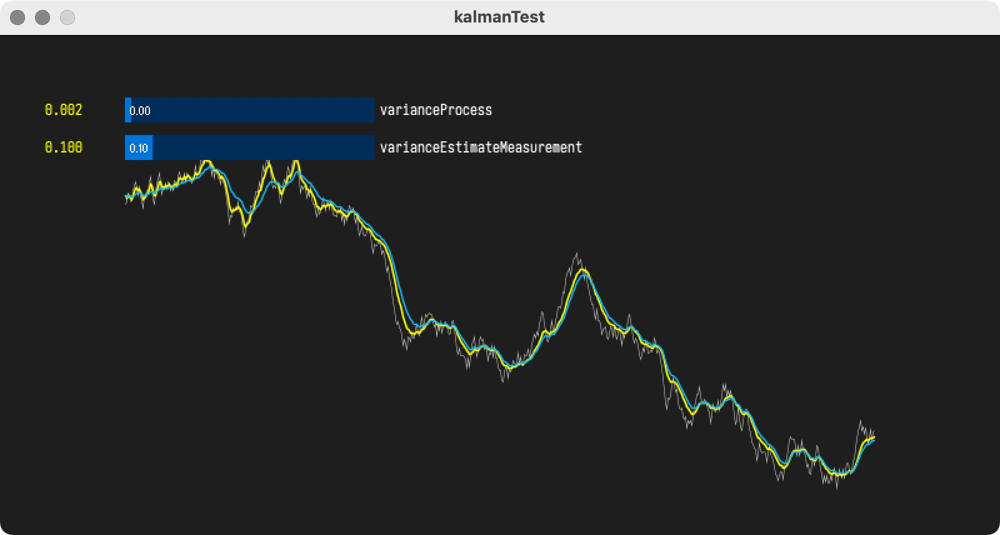

# Simpified Kalman Filter Demo for Processing

kalman filter for remove sensor noise.

-   white : simulated sensor value (noise added)
-   blue : weight filted (moving average)
-   yellow : kalman filtered

## requirements

-   [processing](http://processing.org)

## dependencies

-   [controlP5](https://www.sojamo.de/libraries/controlP5/) processing library
